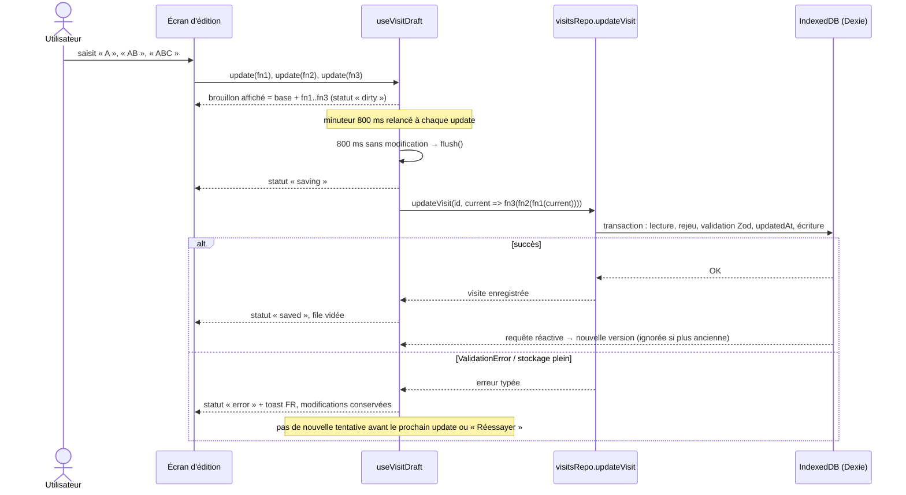

# Architecture

Vue d'ensemble du fonctionnement de l'application (fichier unique `index.html`, ouvert en `file://`, sans serveur). Les choix structurants et leurs raisons sont dans [`DECISIONS.md`](DECISIONS.md), le modèle de données dans [`DATA_MODEL.md`](DATA_MODEL.md).

## Couches

```
Composants React (src/features/*/…Page.tsx, dialogues)
        │  lisent via les hooks, écrivent via les repositories
        ▼
Hooks (useVisitSummaries, useVisit, useVisitDraft, usePhotos…)
        │  useLiveQuery (Dexie) : se mettent à jour quand la base change
        ▼
Repositories (visitsRepo, photosRepo, plansRepo)
        │  validation Zod, transactions, erreurs typées
        ▼
Dexie → IndexedDB (base « cp-compte-rendu »)
```

**Règle : les composants ne touchent jamais `db` directement.** Toute lecture passe par un hook, toute écriture par une fonction de repository. C'est ce qui garantit la validation à chaque écriture, les cascades en transaction et la traduction des erreurs en messages français. Seuls les tests peuvent préparer des données directement dans `db`.

Toute erreur d'une action utilisateur est affichée en toast via `notifyError()` (`src/lib/notify.ts`), qui passe par `toUserMessage()`. Aucune erreur n'est ignorée silencieusement.

## Routage par hash

`src/app/router.ts` est un routeur minimal, écrit pour le projet (~100 lignes) :

| Hash                | Écran                                |
| ------------------- | ------------------------------------ |
| `#/`                | Liste des visites                    |
| `#/visits/:id`      | Redirigé vers `#/visits/:id/general` |
| `#/visits/:id/:tab` | Édition de la visite, onglet `:tab`  |

- **Pourquoi le hash** : ouvert en `file://`, le fichier ne peut pas servir d'autres chemins (`/visits/…` pointerait vers un fichier inexistant). Le fragment `#…` fonctionne en `file://`, survit au rechargement, et le bouton Précédent du navigateur marche.
- Un onglet inconnu redirige vers `general`, une route inconnue vers `#/`. Ces redirections utilisent `history.replaceState` et n'ajoutent donc pas d'entrée d'historique.
- API : `useRoute()` (route typée en union discriminée), `navigate(route)`, `<Link to={route}>` (un vrai `<a href="#/…">` : clic molette, copie de lien et clavier fonctionnent).
- L'écran d'édition est rendu avec `key={visitId}` : changer de visite recrée proprement son état.

## Enregistrement automatique (`useVisitDraft`)

Brique commune à tous les écrans d'édition. `useVisitDraft(id)` retourne `{ draft, update, status, error, flush, discard }`.

**Stratégie : le brouillon local fait foi tant qu'il contient des modifications non enregistrées.**

- Chaque `update(fn)` ajoute `fn` à une **file de modifications en attente**, et l'affichage se met à jour immédiatement. Le brouillon affiché est « dernière version connue de la visite + modifications en attente ».
- La sauvegarde part **800 ms après la dernière modification**, ou immédiatement avec `flush()`. Elle **rejoue** les modifications en attente dans `visitsRepo.updateVisit`, sur la version actuellement en base. Une modification faite entre-temps par une autre action est donc conservée, et un champ en cours de saisie ne « saute » jamais.
- Tant que rien n'est en attente, le brouillon suit la base (requête réactive) : il se resynchronise après une action extérieure.
- Les sauvegardes sont **sérialisées** : une seule à la fois. Une modification faite pendant une sauvegarde reste en attente et part au cycle suivant.
- `flush()` est appelé : au changement d'onglet, au retour à la liste, au démontage, sur `pagehide` et quand la page devient cachée (`visibilitychange`). `beforeunload` déclenche l'avertissement natif du navigateur s'il reste des modifications non enregistrées.
- En cas d'erreur (validation, stockage) : statut `error`, toast en français, les modifications restent en attente, et **aucune nouvelle tentative automatique** n'a lieu tant que l'utilisateur ne modifie rien ou ne clique pas sur « Réessayer ».
- Avant une duplication, l'écran d'édition appelle `flush()` pour que la copie contienne les dernières modifications. Avant une suppression, il appelle `discard()` : les modifications en attente sont abandonnées puisque la visite disparaît.
- `updatedAt` est géré par le repository, pas par le hook.

Contrainte pour les étapes suivantes : un `update` doit être une **fonction pure** de la visite reçue (`(v) => ({ ...v, title })`), car elle peut être rejouée sur une version plus récente.



## Composants d'interface

Les composants sont ceux de shadcn/ui (même API, mêmes styles). Seuls `Dialog`, `AlertDialog`, `Tabs` et `DropdownMenu` sont réimplémentés sur les **éléments natifs** du navigateur (`<dialog>`, attribut `popover`, positionnement par ancre CSS, motif ARIA des onglets) plutôt que sur Radix. Voir `DECISIONS.md`, n° 13. Le tri utilise un `<select>` natif.

En test (jsdom), `src/test/domPolyfills.ts` simule `showModal()` et l'API Popover.
