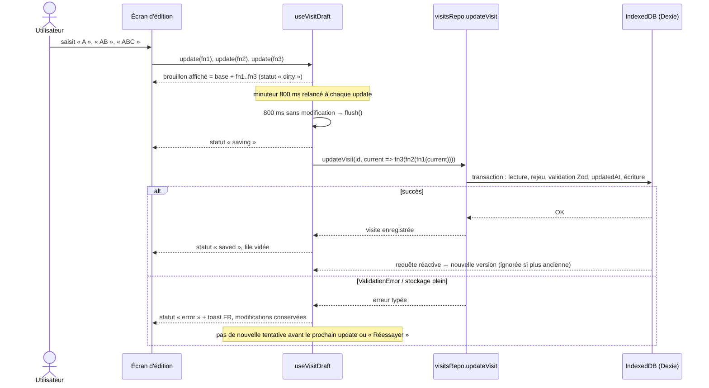
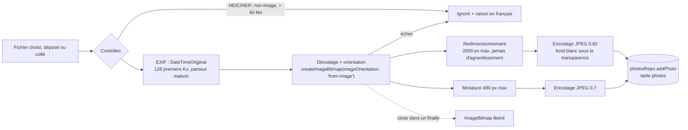
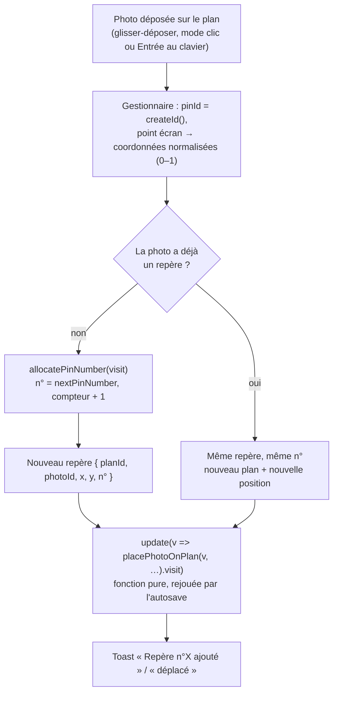
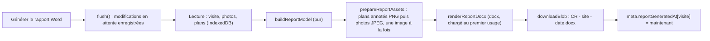

# Architecture

Vue d'ensemble du fonctionnement de l'application (fichier unique `index.html`, ouvert en `file://`, sans serveur). Les choix structurants et leurs raisons sont dans [`DECISIONS.md`](DECISIONS.md), le modèle de données dans [`DATA_MODEL.md`](DATA_MODEL.md).

## Couches

```
Composants React (src/features/*/…Page.tsx, dialogues)
        │  lisent via les hooks, écrivent via les repositories
        ▼
Hooks (useVisitSummaries, useVisit, useVisitDraft, usePhotos…)
        │  useLiveQuery (Dexie) : se mettent à jour quand la base change
        ▼
Repositories (visitsRepo, photosRepo, plansRepo)
        │  validation Zod, transactions, erreurs typées
        ▼
Dexie → IndexedDB (base « cp-compte-rendu »)
```

**Règle : les composants ne touchent jamais `db` directement.** Toute lecture passe par un hook, toute écriture par une fonction de repository. C'est ce qui garantit la validation à chaque écriture, les cascades en transaction et la traduction des erreurs en messages français. Seuls les tests peuvent préparer des données directement dans `db`.

Toute erreur d'une action utilisateur est affichée en toast via `notifyError()` (`src/lib/notify.ts`), qui passe par `toUserMessage()`. Aucune erreur n'est ignorée silencieusement.

## Routage par hash

`src/app/router.ts` est un routeur minimal, écrit pour le projet (~100 lignes) :

| Hash                | Écran                                |
| ------------------- | ------------------------------------ |
| `#/`                | Liste des visites                    |
| `#/visits/:id`      | Redirigé vers `#/visits/:id/general` |
| `#/visits/:id/:tab` | Édition de la visite, onglet `:tab`  |

- **Pourquoi le hash** : ouvert en `file://`, le fichier ne peut pas servir d'autres chemins (`/visits/…` pointerait vers un fichier inexistant). Le fragment `#…` fonctionne en `file://`, survit au rechargement, et le bouton Précédent du navigateur marche.
- Un onglet inconnu redirige vers `general`, une route inconnue vers `#/`. Ces redirections utilisent `history.replaceState` et n'ajoutent donc pas d'entrée d'historique.
- API : `useRoute()` (route typée en union discriminée), `navigate(route)`, `<Link to={route}>` (un vrai `<a href="#/…">` : clic molette, copie de lien et clavier fonctionnent).
- L'écran d'édition est rendu avec `key={visitId}` : changer de visite recrée proprement son état.

## Enregistrement automatique (`useVisitDraft`)

Brique commune à tous les écrans d'édition. `useVisitDraft(id)` retourne `{ draft, update, status, error, flush, discard }`.

**Stratégie : le brouillon local fait foi tant qu'il contient des modifications non enregistrées.**

- Chaque `update(fn)` ajoute `fn` à une **file de modifications en attente**, et l'affichage se met à jour immédiatement. Le brouillon affiché est « dernière version connue de la visite + modifications en attente ».
- La sauvegarde part **800 ms après la dernière modification**, ou immédiatement avec `flush()`. Elle **rejoue** les modifications en attente dans `visitsRepo.updateVisit`, sur la version actuellement en base. Une modification faite entre-temps par une autre action est donc conservée, et un champ en cours de saisie ne « saute » jamais.
- Tant que rien n'est en attente, le brouillon suit la base (requête réactive) : il se resynchronise après une action extérieure.
- Les sauvegardes sont **sérialisées** : une seule à la fois. Une modification faite pendant une sauvegarde reste en attente et part au cycle suivant.
- `flush()` est appelé : au changement d'onglet, au retour à la liste, au démontage, sur `pagehide` et quand la page devient cachée (`visibilitychange`). `beforeunload` déclenche l'avertissement natif du navigateur s'il reste des modifications non enregistrées.
- En cas d'erreur (validation, stockage) : statut `error`, toast en français, les modifications restent en attente, et **aucune nouvelle tentative automatique** n'a lieu tant que l'utilisateur ne modifie rien ou ne clique pas sur « Réessayer ».
- Avant une duplication, l'écran d'édition appelle `flush()` pour que la copie contienne les dernières modifications. Avant une suppression, il appelle `discard()` : les modifications en attente sont abandonnées puisque la visite disparaît.
- `updatedAt` est géré par le repository, pas par le hook.

Contrainte pour les étapes suivantes : un `update` doit être une **fonction pure** de la visite reçue (`(v) => ({ ...v, title })`), car elle peut être rejouée sur une version plus récente. Voir « Règle des fonctions pures » ci-dessous.

**Coalescence** : `update(fn, { coalesceKey: 'site.city' })` remplace la mise à jour en attente précédente si elle porte la même clé, au lieu d'en ajouter une nouvelle. Pendant la saisie d'un champ, la file garde ainsi une seule entrée par champ au lieu d'une par frappe. À réserver aux mises à jour « mettre ce champ à cette valeur », où la nouvelle remplace entièrement l'ancienne. Une mise à jour déjà en cours d'écriture n'est jamais remplacée.

**Champs liés au brouillon** (`src/components/form/DraftFields.tsx`) : pendant la saisie, `DraftInput` et `DraftTextarea` affichent une **copie locale** de ce qui est tapé et transmettent chaque changement au brouillon. À la perte du focus, ils réaffichent la valeur du brouillon. Le nettoyage des espaces ou le refus d'une valeur ne fait donc jamais sauter le curseur. Un champ obligatoire vidé (nom du site, nom d'un participant, titre de section) affiche une erreur, n'envoie rien, puis retrouve sa valeur précédente à la perte du focus : aucun état invalide n'est envoyé à l'enregistrement.



## Règle des fonctions pures

Toute fonction passée à `update` peut être exécutée **plusieurs fois** : au rendu (brouillon affiché = base + modifications en attente), puis à chaque tentative de sauvegarde, où elle est **rejouée** sur la version en base. Elle doit donc être **pure et déterministe** : même visite en entrée, même résultat, sans effet de bord ni mutation.

- **Aucun `createId()`, `Date.now()`, `new Date()`, `todayIso()` ou `Math.random()` dans un updater.** Les identifiants et les dates sont calculés **dans le gestionnaire d'événement**, puis passés en argument.
- La logique de modification vit dans des modules d'opérations purs et testés (`src/features/*/…Ops.ts`). Les composants se contentent d'appeler `update((v) => addParticipant(v, participant))`.
- Ne jamais muter la visite reçue : retourner de nouveaux objets. Les tests appliquent chaque opération à une visite **profondément gelée** (`deepFreeze`).
- ESLint interdit, dans les fichiers `*Ops.ts` et `*View.ts`, l'import de `@/lib/id`, de `todayIso` et `nowIso`, ainsi que `Date.now()`, `new Date()`, `Math.random()` et `crypto.*`.

✅ Correct : l'identifiant est généré une seule fois, dans le gestionnaire.

```ts
const onAdd = () => {
  const participant = { id: createId(), name: entry.name } // ici, une seule fois
  update((v) => addParticipant(v, participant))
}
```

❌ Incorrect : l'identifiant est généré dans l'updater.

```ts
update((v) => addParticipant(v, { id: createId(), name: entry.name }))
```

Ici, l'updater est exécuté une fois pour l'affichage, puis de nouveau à la sauvegarde. Chaque exécution produit un nouvel identifiant : le participant affiché n'a pas le même id que celui enregistré. Les actions suivantes (modifier, supprimer, « Annuler ») visent alors un id qui n'existe pas en base. En cas d'erreur puis de nouvelle tentative, un nouvel id serait encore généré. Même problème avec une date : « aujourd'hui » calculé dans l'updater changerait si la sauvegarde avait lieu après minuit.

Les valeurs d'affichage qui dépendent du temps (« En retard », « Modifiée il y a… », validité d'un contrat, délais DO) sont calculées **au rendu** (`useToday`, `useNow`), jamais stockées par un updater. Les modules de calcul d'affichage (`*View.ts` : `attentionPointView`, `insuranceView`, `doView`) reçoivent « aujourd'hui » **en argument** : ils ne lisent jamais l'horloge, ce qui les rend testables à date fixe et réutilisables tels quels par le rapport Word.

## Pipeline photo

Chaque fichier importé est traité **dans le navigateur**, un à la fois, sans dépendance ni Web Worker (`src/features/photos/processing/`). Seule la version allégée est conservée ; le fichier d'origine ne l'est pas.



| Variante         | Grand côté max. | Qualité JPEG | Usage                                  |
| ---------------- | --------------- | ------------ | -------------------------------------- |
| Image principale | 2000 px         | 0,82         | Visionneuse, rapport Word              |
| Miniature        | 480 px          | 0,7          | Galerie (seules les miniatures y sont) |

**Pourquoi ces valeurs** : une photo pleine largeur dans un rapport A4 (≈ 17 cm à 300 dpi) demande environ 2000 px, donc elle reste nette à l'impression. En JPEG 0,82, une photo de téléphone de 12 Mpx (3 à 6 Mo) descend à **300–600 Ko environ**, soit 5 à 10 fois moins d'espace dans le navigateur. La miniature à 480 px reste nette dans une grille de 4 à 5 colonnes, même sur écran haute densité.

- **Encodage** : `OffscreenCanvas.convertToBlob`, ou `<canvas>.toBlob` en repli. Les PNG et WebP sont aplatis sur fond blanc puis convertis en JPEG.
- **Rotation** (`rotateBlob90`) : l'image principale est redessinée tournée de 90°, puis image et miniature sont réencodées (largeur et hauteur échangées).
- **Import** (`runPhotoImport`) : ordre par date EXIF, sinon par nom en tri naturel. Traitement séquentiel. Un échec n'arrête pas les autres. Un espace plein (`StorageQuotaError`) arrête proprement l'import. L'annulation prend effet après la photo en cours.
- **Codec injectable** : `processPhoto(file, codec)` et `rotateBlob90(blob, dir, codec)` reçoivent décodeur et encodeur. Les tests unitaires (jsdom, sans canvas) vérifient la logique, et Playwright vérifie le vrai traitement dans Chromium.
- **Métadonnées** (légende, catégorie) : enregistrées directement par `photosRepo` via `usePhotoMetaSaver`, 600 ms après la frappe et à la perte du focus, car les photos ne passent pas par le brouillon de la visite.
- **Affichage** : miniatures seulement dans la grille (`loading="lazy"`, `content-visibility: auto`), image principale seulement dans la visionneuse, qui précharge la suivante. `useObjectUrl` partage une URL `blob:` par Blob et ne la révoque qu'un instant après son dernier usage. Sans ce délai, passer de la photo préchargée à la photo affichée révoquait une URL en cours de chargement.
- **Cache Dexie `immutable`** : les résultats des requêtes réactives sont figés au lieu d'être copiés. C'est moins coûteux avec de nombreuses photos, et toute mutation accidentelle d'une donnée lue lève une erreur.

## Plan interactif

### pdf.js dans le fil principal

Les plans PDF (exports AutoCAD) sont rendus par **pdf.js** (`pdfjs-dist`, build « legacy »), **sans Web Worker** :

- le module worker de pdf.js est importé statiquement et exposé via `globalThis.pdfjsWorker = { WorkerMessageHandler }` (`src/features/plan/import/pdfjs.ts`). pdf.js détecte ce gestionnaire et utilise alors son « fake worker » dans le fil principal, sans jamais appeler `new Worker` ni charger de fichier ;
- `getDocument` reçoit `isEvalSupported: false` (ignoré depuis pdf.js 5, qui n'utilise plus `eval`), `useSystemFonts: true` et `useWorkerFetch: false`, **sans** `cMapUrl`, `standardFontDataUrl` ni `wasmUrl` : aucune requête ne part, la CSP est respectée ;
- le module pdf.js n'est **évalué** qu'au premier import d'un PDF (import dynamique résolu dans le même fichier, sans chunk séparé) : le démarrage de l'outil n'est pas ralenti ;
- **pourquoi le fil principal** : le fichier unique ne peut pas fournir de script de worker séparé, et un worker créé depuis un Blob obligerait à assouplir la CSP. Le rendu d'une page A3 à 4096 px prend ~0,15 à 0,3 s ; l'encodage PNG et l'enregistrement portent le total à ~0,5 à 1,2 s (mesuré en e2e) ;
- **build « legacy »** : la build moderne de pdf.js utilise des API JavaScript très récentes (`Map.prototype.getOrInsertComputed`…) absentes de Chrome 141, alors que les postes d'entreprise peuvent avoir quelques versions de retard. La build legacy embarque les polyfills nécessaires ;
- **contenus non rendus** : sans WASM, les images JPEG 2000 (JPX) ou JBIG2 d'un PDF peuvent manquer. Les avertissements de pdf.js sont interceptés pendant le rendu ; dans ce cas, un message propose d'exporter le plan en PNG depuis AutoCAD. Un PDF protégé ou corrompu donne un message en français, sans plantage.

Rendu final : **4096 px** sur le grand côté (agrandi si la page est petite, 8192 px au plus), fond blanc, **PNG**, ou JPEG 0,9 si le PNG dépasse 6 Mo. Les images importées (PNG, JPEG) sont limitées à 4096 px et gardent leur format : Word intègre PNG et JPEG, pas WebP.

### Repères de taille constante

Le plan est une `` transformée en CSS (`translate(tx, ty) scale(s)`). Les repères ne sont **pas** dans ce calque : ce sont des boutons positionnés à `normalizedToScreen(pin, view)` (`viewport.ts`). Ils gardent donc **28 px à l'écran quel que soit le zoom**, et restent exactement à leur place relative (coordonnées normalisées 0–1). Le même style (couleur par catégorie, bordure blanche, ombre, `pinStyle.ts`) est utilisé à l'écran et dans l'image générée (`renderAnnotatedPlan`).

### Enregistrement uniquement au relâchement

Zoom, déplacement du plan et glisser d'un repère ne modifient qu'un **état local** (vue, position provisoire). La visite n'est modifiée (`update`) **qu'une seule fois**, au relâchement du repère. Au clavier, chaque appui (flèche, Maj + flèche) compte pour une action, donc un `update`. Le zoom ne touche jamais la visite (vérifié en e2e avec 30 repères : ~58 images/s).

### Une photo, un repère

Une photo a **au plus un repère**. `placePhotoOnPlan` crée le repère (numéro tiré de `nextPinNumber`) ou, si la photo est déjà placée, **déplace** son repère (autre plan éventuellement) en **conservant son numéro**.



## DO & assurances

Toute la logique est dans des modules purs, sans React, réutilisés par l'onglet et, à l'étape 10, par le rapport Word :

| Module                                          | Rôle                                                                                   |
| ----------------------------------------------- | -------------------------------------------------------------------------------------- |
| `insurance/insuranceView.ts`                    | Validité d'un contrat, libellé du badge, compteurs, ordre d'affichage                  |
| `insurance/insuranceOps.ts`                     | Ajouter, modifier, supprimer / réinsérer un contrat                                    |
| `do/doView.ts`                                  | Séquence des étapes, progression, étape courante, délais indicatifs, alertes, synthèse |
| `do/doClaimOps.ts`                              | Déclarer un sinistre (10 étapes), modifier, statut d'étape, retirer / rétablir         |
| `do/doInsuranceOverview.ts`                     | Bandeau de synthèse et indicateur de l'onglet (« DO & assurances (2) » + pastille)     |
| `lib/dates.ts` (`addDaysIso`, `daysBetweenIso`) | Calculs de jours en UTC sur des dates pures (aucun décalage à l'heure d'été)           |

- `createDoClaim` reçoit les **10 identifiants d'étapes**, générés dans le gestionnaire ; `setStepStatus` reçoit la date du jour (`todayIso()` appelé dans le gestionnaire) pour renseigner la date d'une étape passée à « Terminé ».
- Les montants passent par `DraftAmountInput` (`components/form`) : saisie libre, envoi de chaque valeur valide (`parseEurosInput`), erreur en ligne sinon, et retour à la valeur d'avant la saisie à la perte du focus. Une saisie invalide n'est jamais envoyée : elle ne bloque pas l'enregistrement.
- Le repli d'un sinistre clôturé est un état local de la carte (non enregistré).

## Projets et coûts

| Module                    | Rôle                                                                                            |
| ------------------------- | ----------------------------------------------------------------------------------------------- |
| `projects/projectView.ts` | Ordre d'affichage des projets, totaux des coûts liés, compteurs par statut                      |
| `projects/projectOps.ts`  | Ajouter, modifier un projet ; `removeProject` (coûts détachés ou supprimés) et `restoreProject` |
| `costs/costView.ts`       | Montants d'une ligne, totaux par stade, groupes et sous-totaux, bandeau, export TSV / CSV       |
| `costs/costOps.ts`        | Ajouter, modifier, supprimer / rétablir des lignes, rattacher à un projet                       |

- Tous les montants restent en **centimes entiers**. La TVA est arrondie **par ligne** (`computeVatCents`) et les totaux sont des sommes de lignes (`sumCosts`) : sous-totaux et total général concordent toujours.
- Le regroupement (projet, statut, catégorie), les groupes repliés et le projet présélectionné dans la saisie rapide sont un **état local** de l'onglet, jamais enregistré.
- « Copier pour Excel » : `navigator.clipboard.writeText(costsToTsv(...))` ; en cas d'échec, `downloadBlob` d'un CSV (`costsToCsv`), nommé avec `safeFileName` (`src/lib/download.ts`, partagé avec le plan annoté).

## Rapport Word

Le rapport est produit en **deux couches** (`src/features/report/`) :

1. **Modèle pur** — `model/buildReportModel.ts` reçoit la visite, les métadonnées des photos et des plans, les options, « aujourd'hui » et l'heure de génération, et renvoie un `ReportModel` **sérialisable** (`model/reportModel.ts`) : rubriques dans l'ordre, titres numérotés, textes déjà formatés en français, tons (rouge, orange, gris…), tableaux, identifiants des images. **Toute la logique est là** (quoi afficher, ordre, omissions, totaux, alertes), et elle réutilise les modules de calcul existants (`attentionPointView`, `doView`, `doInsuranceOverview`, `insuranceView`, `projectView`, `costView`, `money`, `dates`) : le rapport montre exactement les mêmes chiffres que les écrans. Aucune horloge n'est lue (règle ESLint des fonctions pures étendue à `report/model/`). `parseNoteContent` transforme le texte des notes en paragraphes et listes à puces ; `reportContents.ts` fournit l'aperçu des rubriques et les « points à vérifier » de l'onglet ; `estimateReportSize.ts` l'estimation de taille.
2. **Rendu mécanique** — `render/renderReportDocx.ts` traduit le modèle en objets `docx`, sans aucune décision métier : page de garde, pages A4 portrait, en-tête et pied de page, tableaux, encadrés, grille de photos. Couleurs, polices, tailles et géométrie des pages viennent d'une seule source : `render/docxStyles.ts`.

Pipeline de génération (`useReportGeneration`) :



**Pipeline des images** (`render/prepareReportAssets.ts`) : seules les images présentes dans le modèle sont traitées, **une par une** ; chaque bitmap est fermé et chaque canevas libéré avant l'image suivante, et la boucle rend la main au navigateur entre deux images (progression « Photos 12 / 42… », interface utilisable).

| Qualité  | Photos             | Plans annotés (`renderAnnotatedPlan`) |
| -------- | ------------------ | ------------------------------------- |
| Standard | 1600 px, JPEG 0,8  | 3000 px, PNG                          |
| Allégée  | 1000 px, JPEG 0,75 | 2000 px, PNG                          |

Le logo (PNG inliné) est rastérisé en PNG à la taille voulue. Les images sont dédupliquées par `docx` (empreinte SHA-1) : le logo de la page de garde et des en-têtes n'est stocké qu'une fois.

**Compatibilité Word** : styles de titres natifs (volet de navigation), pas de table des matières par champ, seuls les champs `PAGE` / `NUMPAGES` au pied de page, interligne en mode « auto » (un interligne exact rognerait les images en ligne), tableaux à largeurs fixes en twips, lignes insécables pour les photos. Le rendu est vérifié par les tests (`renderReportDocx.test.ts` ouvre l'archive générée en Node ; `report.spec.ts` télécharge le fichier depuis l'application en `file://`).

## Composants d'interface

Les composants sont ceux de shadcn/ui (même API, mêmes styles). Seuls `Dialog`, `AlertDialog`, `Tabs` et `DropdownMenu` sont réimplémentés sur les **éléments natifs** du navigateur (`<dialog>`, attribut `popover`, positionnement par ancre CSS, motif ARIA des onglets) plutôt que sur Radix. Voir `DECISIONS.md`, n° 13. Le tri utilise un `<select>` natif. Les suggestions de saisie utilisent `<datalist>`, et les zones de texte s'agrandissent avec leur contenu grâce à `field-sizing: content` (sans JavaScript).

En test (jsdom), `src/test/domPolyfills.ts` simule `showModal()`, l'API Popover, la capture de pointeur et `ResizeObserver`.

Les téléchargements (plan annoté, puis rapport Word) passent par `downloadBlob` (`src/lib/download.ts`) : `<a download>` sur une URL `blob:`.
