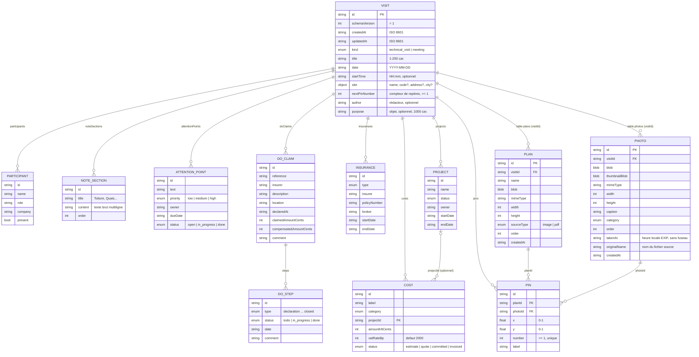

# Modèle de données

Source de vérité : les schémas Zod de `src/types/` (`visit.ts`, `media.ts`, `common.ts`). Les types TypeScript en sont **inférés** (`z.infer`), sans interface dupliquée. Les libellés français des énumérations sont dans `src/types/labels.ts`.

## Vue d'ensemble

Trois tables IndexedDB (base `cp-compte-rendu`, Dexie, version 1) contiennent les données métier, plus une table technique :

| Table    | Clé / index                        | Contenu                                                               |
| -------- | ---------------------------------- | --------------------------------------------------------------------- |
| `visits` | `id`, `updatedAt`, `date`, `kind`  | La visite et tous ses sous-objets **légers** (JSON, pas de binaire).  |
| `photos` | `id`, `visitId`, `[visitId+order]` | Une photo par ligne : `blob` + `thumbnailBlob`.                       |
| `plans`  | `id`, `visitId`, `[visitId+order]` | Un plan par ligne : `blob` (image ; les PDF sont convertis en image). |
| `meta`   | `key`                              | Métadonnées techniques (`lastOpenedAt`, `reportGeneratedAt`, `storageNoticeDismissedAt`).             |

## Règles clés

### Formats

- **Montants** : toujours en **centimes entiers** (`amountHtCents`, `claimedAmountCents`…), jamais de flottant. Conversion et affichage via `src/lib/money.ts` (`parseEurosInput`, `formatEuros`).
- **TVA** : en **points de base** (`2000` = 20 %, `550` = 5,5 %). La TVA est arrondie au centime **par ligne**, puis sommée (`sumCosts`).
- **Dates métier** : `YYYY-MM-DD` (date calendaire, sans fuseau). **Horodatages** (`createdAt`, `updatedAt`, `takenAt`) : ISO 8601 complet.
- **Identifiants** : UUID v4 (`createId()` dans `src/lib/id.ts`).
- **`schemaVersion`** : `1` sur chaque visite, pour les migrations et l'import (étape 9).

### Champs de la visite ajoutés à l'étape 4

- `author?` (120 caractères max.) : **rédacteur** du compte rendu. Les suggestions comprennent Arnaud Montigny, Emre Akagunduz, Jean-Christophe Bains, ainsi que les rédacteurs des autres visites.
- `purpose?` (1 000 caractères max.) : **objet** de la visite ou de la réunion.
- Les deux sont optionnels : absents des visites plus anciennes, ils valent « non renseigné » (`undefined`). `normalizeVisit` n'a rien à ajouter, et aucune nouvelle version Dexie n'est nécessaire.
- Règle générale des champs texte optionnels : les espaces de bord sont supprimés, et une chaîne vide **retire la clé** au lieu de stocker `""`.

### Ordre et affichage

- Les **sections de notes** sont stockées avec `order` = 0..n-1, recalculé à chaque ajout, suppression ou déplacement. `content` est du texte brut ; une ligne commençant par « - » deviendra une puce dans le rapport (étape 10).
- Les **points d'attention** sont stockés dans l'ordre de saisie. Le tri affiché (non terminés d'abord, puis priorité décroissante, puis échéance croissante) et le badge « En retard » sont calculés à l'affichage (`attentionPointView.ts`), sans modifier les données.

### Photos (étape 5)

- `blob` : image principale JPEG, 2000 px max. sur le grand côté. `thumbnailBlob` : miniature JPEG, 480 px max. Le fichier d'origine n'est **pas** conservé.
- `width` / `height` : dimensions de l'image principale, orientation EXIF déjà appliquée (échangées après une rotation).
- `takenAt?` : date de prise de vue EXIF (`DateTimeOriginal`), en **heure locale sans fuseau** (`YYYY-MM-DDTHH:mm:ss`), car l'EXIF n'enregistre pas le fuseau.
- `originalName?` : nom du fichier source, affiché en indication. Champ optionnel, sans nouvelle version Dexie.
- `order` : position dans la galerie, 0..n-1 (import : à la suite des photos existantes).

### Binaires hors de la visite

Les photos et les plans (Blob) sont dans leurs propres tables, jamais dans l'objet visite : la liste des visites reste légère (`listVisitSummaries` ne charge aucun Blob ; le nombre de photos est calculé sur l'index `visitId`). Pour afficher un Blob, utiliser **uniquement** le hook `useObjectUrl(blob)`, qui révoque l'URL au démontage.

### Pins (repères sur plan)

- Stockés **dans la visite** (légers), ils relient une photo (`photoId`) à un plan (`planId`).
- `x` et `y` sont **normalisés entre 0 et 1** par rapport à la largeur et la hauteur du plan : indépendants du zoom et de la résolution d'affichage.
- `number` : entier ≥ 1, **unique par visite** (contrôlé par le schéma) et **stable** : supprimer un repère ne renumérote pas les autres.
- **Un numéro n'est jamais réattribué, même après suppression** (y compris du plus grand) : la visite porte un compteur `nextPinNumber` (≥ 1, défaut 1) qui ne fait qu'augmenter. Pour créer un repère, appeler `allocatePinNumber(visit)` dans le même `updateVisit` que l'ajout du repère : la fonction renvoie le numéro et la visite avec le compteur incrémenté. Le schéma vérifie que `nextPinNumber` est supérieur à tous les numéros existants.
- Visites enregistrées avant l'existence du compteur : `normalizeVisit` (appelée à chaque lecture par le repository) le calcule comme « plus grand numéro + 1 ».
- Supprimer une photo ou un plan supprime, dans la même transaction, les repères qui y font référence.
- **Une photo, un repère** : une photo a au plus un repère (`placePhotoOnPlan`). Replacer une photo déjà placée **déplace** son repère (nouveau plan et nouvelle position) en **conservant son numéro**, sans toucher au compteur. Retirer un repère ne libère pas son numéro ; « Annuler » le restaure avec le même numéro et la même position.
- L'étiquette `label?` est propre au repère (distincte de la légende de la photo).

### Plans (étape 6)

- `blob` : image du plan en **PNG** (rendu d'une page PDF à 4096 px sur le grand côté, ou JPEG 0,9 si le PNG dépasse 6 Mo) ou image importée (PNG / JPEG, 4096 px max., format conservé). Jamais de WebP : le rapport Word doit pouvoir l'intégrer.
- `width` / `height` : dimensions de cette image. Les coordonnées des repères sont normalisées (0–1) par rapport à elles.
- `sourceType` : `pdf` ou `image`. Plusieurs plans par visite (bâtiments, niveaux, cellules), ordonnés par `order`.

### Sinistres DO et assurances (étape 7)

**Séquence canonique des étapes** (`DO_STEP_SEQUENCE`, dans `src/features/do/doView.ts`) :

| #   | `type`               | Libellé                                |
| --- | -------------------- | -------------------------------------- |
| 1   | `declaration`        | Déclaration du sinistre                |
| 2   | `acknowledgment`     | Accusé de réception de l'assureur      |
| 3   | `expert_appointed`   | Désignation de l'expert                |
| 4   | `expertise`          | Expertise                              |
| 5   | `preliminary_report` | Rapport préliminaire                   |
| 6   | `coverage_decision`  | Position de l'assureur sur la garantie |
| 7   | `compensation_offer` | Proposition d'indemnité                |
| 8   | `compensation_paid`  | Versement de l'indemnité               |
| 9   | `repair_works`       | Travaux de réparation                  |
| 10  | `closed`             | Clôture du dossier                     |

- **Création** : un sinistre déclaré reçoit les 10 étapes, dans cet ordre, au statut `todo`. Au plus une étape par `type`.
- **Étapes retirables** : une étape non applicable est **supprimée** de `steps` (« Non applicable »). `getMissingStepTypes(claim)` liste les types retirés ; « Rétablir une étape » la réinsère **à sa position canonique** (avant la première étape restante qui la suit dans la séquence), au statut `todo`. L'annulation d'un retrait rétablit l'étape à l'identique (id, statut, date, commentaire).
- **Statut « Terminé »** : passer une étape à `done` renseigne sa `date` avec la date du jour si elle est vide ; une date existante est conservée.
- **Étape courante** : première étape non terminée dans l'ordre de la liste. **Progression** : étapes terminées / étapes présentes. **Clôturé** : l'étape `closed` existe et est terminée.
- **Délais indicatifs** (`computeDoDeadlines`) : date de référence = date de l'étape `acknowledgment`, sinon `declaredAt`, sinon date de l'étape `declaration` ; aucun délai sans l'une d'elles. Position sur la garantie attendue à **référence + 60 jours**, proposition d'indemnité à **référence + 90 jours**, calcul en jours calendaires sur des dates pures (UTC). Alerte (`getDeadlineAlerts`) tant que l'étape correspondante (`coverage_decision`, `compensation_offer`) existe, n'est pas terminée et que le dossier n'est pas clôturé : `overdue` si l'échéance est dépassée, `due_soon` si elle tombe dans 15 jours ou moins (le jour même compris), `ok` sinon. Ces délais sont **indicatifs** (voir `DECISIONS.md`, 23 et 24).
- **Validité d'un contrat** (`getInsuranceValidity`) : `not_started` si la date de début est future, `unknown` sans date de fin, `expired` si la date de fin est passée, `expiring_soon` si elle tombe dans 90 jours ou moins (la date de fin est le dernier jour couvert : un contrat qui finit aujourd'hui est encore en vigueur), `valid` sinon. Calculée à l'affichage, jamais stockée.
- **Montants** : `claimedAmountCents` et `compensatedAmountCents`, en centimes, facultatifs. Un montant indemnisé supérieur au montant réclamé est un avertissement, pas une erreur.

### Projets et coûts (étape 8)

**Stades d'un coût** (`COST_STAGE_ORDER`, dans `src/features/costs/costView.ts`), du moins au plus certain :

| Ordre | `status`    | Libellé    | Ligne de total | Signification                      |
| ----- | ----------- | ---------- | -------------- | ---------------------------------- |
| 1     | `estimate`  | Estimation | Estimations    | Montant estimé, sans devis         |
| 2     | `quote`     | Devis reçu | Devis reçus    | Devis reçu, pas encore commandé    |
| 3     | `committed` | Engagé     | Engagé         | Commande passée ou dépense décidée |
| 4     | `invoiced`  | Facturé    | Facturé        | Facture reçue                      |

- **Montants** : `amountHtCents` (entier ≥ 0) et `vatRateBp` (points de base, 2000 = 20 %) sont les seules valeurs stockées. La TVA et le TTC sont **calculés**, jamais stockés : TVA d'une ligne = `computeVatCents(HT, taux)`, arrondie au centime ; TTC = HT + TVA arrondie. Tout total (projet, groupe, stade, total général) est la **somme des lignes** (`sumCosts`).
- **Jamais de `projectId` orphelin** : `cost.projectId` désigne toujours un projet de la même visite (erreur de validation sinon). Les opérations le garantissent : un projet inconnu est refusé (`addCost`, `updateCost`, `moveCostsToProject`), une ligne rétablie par « Annuler » dont le projet a disparu revient « Non rattachée » (`insertCostAt`), et un projet n'est jamais supprimé seul.
- **Suppression d'un projet** (`removeProject(visit, id, mode)`) :
  - `detach_costs` : ses lignes de coûts restent, sans projet (groupe « Non rattachés ») ;
  - `delete_costs` : ses lignes sont supprimées avec lui.

  Dans les deux cas, l'opération renvoie un instantané (projet, index, lignes touchées avec leur index et leur `projectId` d'origine) ; `restoreProject` remet la visite **à l'identique**.

- **Ordre d'affichage des projets** : en cours, planifié, identifié, suspendu, terminé, puis par date de début (sans date en dernier). L'ordre stocké reste l'ordre de saisie.

### Cohérence

Erreurs bloquantes (validation Zod, messages en français) :

- `endDate` ≥ `startDate` quand les deux sont renseignées (assurances, projets) ;
- `cost.projectId` doit désigner un projet de la même visite ;
- numéros de repères uniques, et `nextPinNumber` supérieur à chacun d'eux ;
- montants entiers ≥ 0, TVA entre 0 et 10 000 pb, coordonnées entre 0 et 1, dates et heures valides, titre non vide (200 caractères maximum).

Avertissements non bloquants (`getVisitWarnings(visit)`) : montant indemnisé supérieur au montant réclamé sur un sinistre DO.

### Duplication (« reprendre le suivi »)

`duplicateVisit(id)` crée une nouvelle visite **datée du jour**, titrée « Copie — {titre} » :

| Repris                                                                      | Non repris                 |
| --------------------------------------------------------------------------- | -------------------------- |
| Site                                                                        | Sections de notes          |
| Participants (tous remis à « absent »)                                      | Photos                     |
| Sinistres DO (étapes, statuts, dates, montants), assurances, projets, coûts | Repères (pins)             |
| Points d'attention **non traités** (`status` ≠ `done`)                      | Points d'attention traités |
| Plans (copie des fichiers)                                                  |                            |

Tous les identifiants des sous-objets sont régénérés, `nextPinNumber` repart à 1 (aucun repère copié), et `cost.projectId` est remappé vers le nouvel identifiant du projet. L'opération se fait dans une seule transaction.

## Couche de stockage

- `src/lib/db/db.ts` : instance Dexie unique `db`, schéma version 1.
- Repositories (`src/features/*/…Repo.ts`) : fonctions async, **validation Zod à chaque écriture**, opérations multi-tables en **transaction** (suppression en cascade, duplication, suppression de repères).
- Hooks réactifs (`useVisitSummaries`, `useVisit`, `usePhotos`, `usePlans`) : `{ data, isLoading, error }` ; un identifiant inconnu donne `isLoading: false` et une `NotFoundError`.
- Édition avec enregistrement automatique : `useVisitDraft` (voir [`ARCHITECTURE.md`](ARCHITECTURE.md)).
- Le résumé de liste (`VisitSummary`) contient aussi `planCount` (utilisé par le dialogue de suppression).
- Erreurs typées (`src/lib/errors.ts`) : `NotFoundError`, `ValidationError` (liste des champs en français), `StorageQuotaError`, `StorageUnavailableError`. `toUserMessage(err)` donne le message à afficher.

## Faire évoluer le schéma

Ne jamais modifier `db.version(1)` une fois diffusé. Ajouter `db.version(2).stores({...}).upgrade(tx => ...)` et, si le format d'une visite change, incrémenter `VISIT_SCHEMA_VERSION` en prévoyant la migration des visites existantes et importées.
