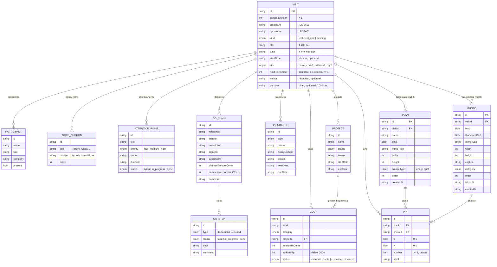

# Modèle de données

Source de vérité : les schémas Zod de `src/types/` (`visit.ts`, `media.ts`, `common.ts`). Les types TypeScript en sont **inférés** (`z.infer`), sans interface dupliquée. Les libellés français des énumérations sont dans `src/types/labels.ts`.

## Vue d'ensemble

Trois tables IndexedDB (base `cp-compte-rendu`, Dexie, version 1) contiennent les données métier, plus une table technique :

| Table    | Clé / index                        | Contenu                                                               |
| -------- | ---------------------------------- | --------------------------------------------------------------------- |
| `visits` | `id`, `updatedAt`, `date`, `kind`  | La visite et tous ses sous-objets **légers** (JSON, pas de binaire).  |
| `photos` | `id`, `visitId`, `[visitId+order]` | Une photo par ligne : `blob` + `thumbnailBlob`.                       |
| `plans`  | `id`, `visitId`, `[visitId+order]` | Un plan par ligne : `blob` (image ; les PDF sont convertis en image). |
| `meta`   | `key`                              | Métadonnées techniques (`lastOpenedAt`, `lastExportAt`…).             |

## Règles clés

### Formats

- **Montants** : toujours en **centimes entiers** (`amountHtCents`, `claimedAmountCents`…), jamais de flottant. Conversion et affichage via `src/lib/money.ts` (`parseEurosInput`, `formatEuros`).
- **TVA** : en **points de base** (`2000` = 20 %, `550` = 5,5 %). La TVA est arrondie au centime **par ligne**, puis sommée (`sumCosts`).
- **Dates métier** : `YYYY-MM-DD` (date calendaire, sans fuseau). **Horodatages** (`createdAt`, `updatedAt`, `takenAt`) : ISO 8601 complet.
- **Identifiants** : UUID v4 (`createId()` dans `src/lib/id.ts`).
- **`schemaVersion`** : `1` sur chaque visite, pour les migrations et l'import (étape 9).

### Champs de la visite ajoutés à l'étape 4

- `author?` (120 caractères max.) : **rédacteur** du compte rendu. Les suggestions comprennent Arnaud Montigny, Emre Akagunduz, Jean-Christophe Bains, ainsi que les rédacteurs des autres visites.
- `purpose?` (1 000 caractères max.) : **objet** de la visite ou de la réunion.
- Les deux sont optionnels : absents des visites plus anciennes, ils valent « non renseigné » (`undefined`). `normalizeVisit` n'a rien à ajouter, et aucune nouvelle version Dexie n'est nécessaire.
- Règle générale des champs texte optionnels : les espaces de bord sont supprimés, et une chaîne vide **retire la clé** au lieu de stocker `""`.

### Ordre et affichage

- Les **sections de notes** sont stockées avec `order` = 0..n-1, recalculé à chaque ajout, suppression ou déplacement. `content` est du texte brut ; une ligne commençant par « - » deviendra une puce dans le rapport (étape 10).
- Les **points d'attention** sont stockés dans l'ordre de saisie. Le tri affiché (non terminés d'abord, puis priorité décroissante, puis échéance croissante) et le badge « En retard » sont calculés à l'affichage (`attentionPointView.ts`), sans modifier les données.

### Binaires hors de la visite

Les photos et les plans (Blob) sont dans leurs propres tables, jamais dans l'objet visite : la liste des visites reste légère (`listVisitSummaries` ne charge aucun Blob ; le nombre de photos est calculé sur l'index `visitId`). Pour afficher un Blob, utiliser **uniquement** le hook `useObjectUrl(blob)`, qui révoque l'URL au démontage.

### Pins (repères sur plan)

- Stockés **dans la visite** (légers), ils relient une photo (`photoId`) à un plan (`planId`).
- `x` et `y` sont **normalisés entre 0 et 1** par rapport à la largeur et la hauteur du plan : indépendants du zoom et de la résolution d'affichage.
- `number` : entier ≥ 1, **unique par visite** (contrôlé par le schéma) et **stable** : supprimer un repère ne renumérote pas les autres.
- **Un numéro n'est jamais réattribué, même après suppression** (y compris du plus grand) : la visite porte un compteur `nextPinNumber` (≥ 1, défaut 1) qui ne fait qu'augmenter. Pour créer un repère, appeler `allocatePinNumber(visit)` dans le même `updateVisit` que l'ajout du repère : la fonction renvoie le numéro et la visite avec le compteur incrémenté. Le schéma vérifie que `nextPinNumber` est supérieur à tous les numéros existants.
- Visites enregistrées avant l'existence du compteur : `normalizeVisit` (appelée à chaque lecture par le repository) le calcule comme « plus grand numéro + 1 ».
- Supprimer une photo ou un plan supprime, dans la même transaction, les repères qui y font référence.

### Cohérence

Erreurs bloquantes (validation Zod, messages en français) :

- `endDate` ≥ `startDate` quand les deux sont renseignées (assurances, projets) ;
- `cost.projectId` doit désigner un projet de la même visite ;
- numéros de repères uniques, et `nextPinNumber` supérieur à chacun d'eux ;
- montants entiers ≥ 0, TVA entre 0 et 10 000 pb, coordonnées entre 0 et 1, dates et heures valides, titre non vide (200 caractères maximum).

Avertissements non bloquants (`getVisitWarnings(visit)`) : montant indemnisé supérieur au montant réclamé sur un sinistre DO.

### Duplication (« reprendre le suivi »)

`duplicateVisit(id)` crée une nouvelle visite **datée du jour**, titrée « Copie — {titre} » :

| Repris                                                       | Non repris                 |
| ------------------------------------------------------------ | -------------------------- |
| Site                                                         | Sections de notes          |
| Participants (tous remis à « absent »)                       | Photos                     |
| Sinistres DO (avec leurs étapes), assurances, projets, coûts | Repères (pins)             |
| Points d'attention **non traités** (`status` ≠ `done`)       | Points d'attention traités |
| Plans (copie des fichiers)                                   |                            |

Tous les identifiants des sous-objets sont régénérés, `nextPinNumber` repart à 1 (aucun repère copié), et `cost.projectId` est remappé vers le nouvel identifiant du projet. L'opération se fait dans une seule transaction.

## Couche de stockage

- `src/lib/db/db.ts` : instance Dexie unique `db`, schéma version 1.
- Repositories (`src/features/*/…Repo.ts`) : fonctions async, **validation Zod à chaque écriture**, opérations multi-tables en **transaction** (suppression en cascade, duplication, suppression de repères).
- Hooks réactifs (`useVisitSummaries`, `useVisit`, `usePhotos`, `usePlans`) : `{ data, isLoading, error }` ; un identifiant inconnu donne `isLoading: false` et une `NotFoundError`.
- Édition avec enregistrement automatique : `useVisitDraft` (voir [`ARCHITECTURE.md`](ARCHITECTURE.md)).
- Le résumé de liste (`VisitSummary`) contient aussi `planCount` (utilisé par le dialogue de suppression).
- Erreurs typées (`src/lib/errors.ts`) : `NotFoundError`, `ValidationError` (liste des champs en français), `StorageQuotaError`, `StorageUnavailableError`. `toUserMessage(err)` donne le message à afficher.

## Faire évoluer le schéma

Ne jamais modifier `db.version(1)` une fois diffusé. Ajouter `db.version(2).stores({...}).upgrade(tx => ...)` et, si le format d'une visite change, incrémenter `VISIT_SCHEMA_VERSION` en prévoyant la migration des visites existantes et importées.
